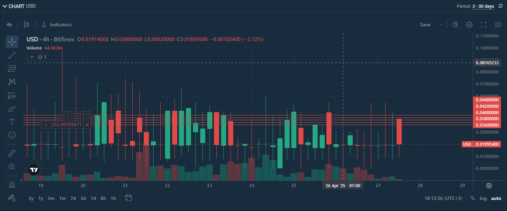
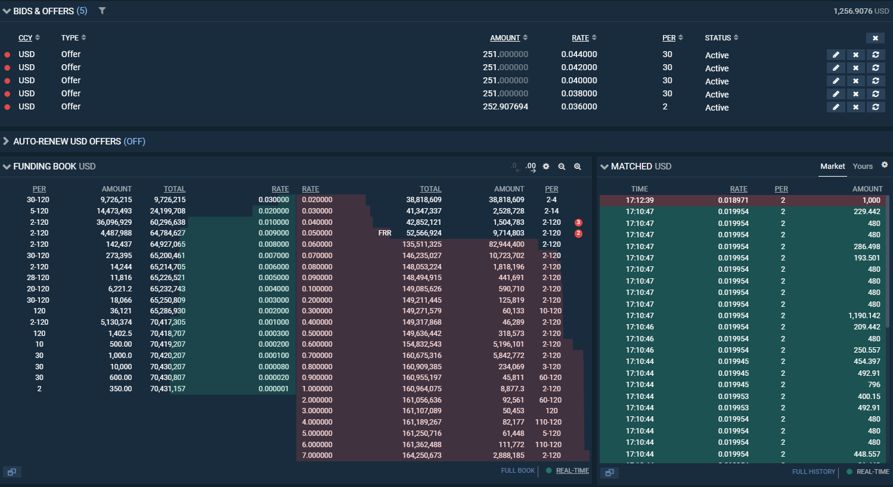
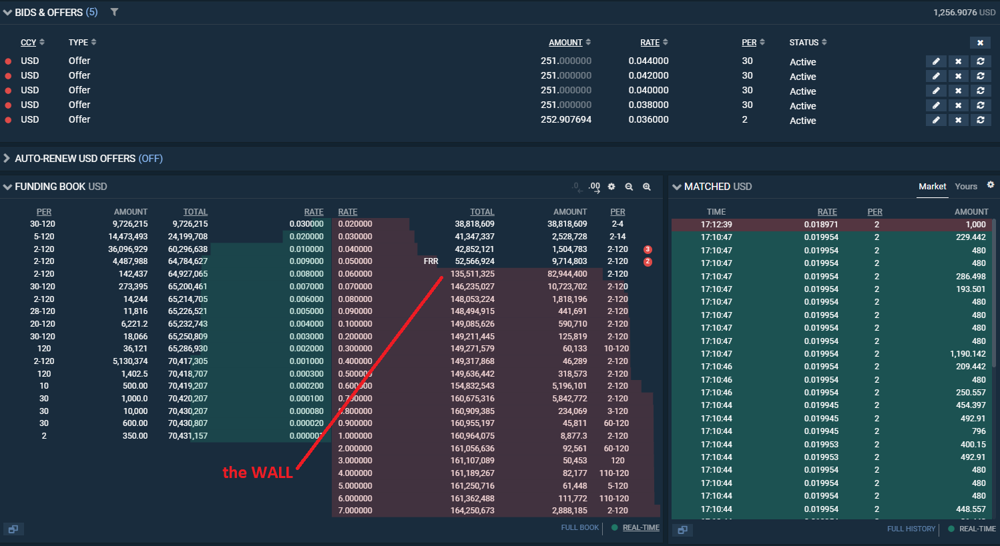

# SelfDrive Financial Resources

> **Automated Bitfinex Funding Bot** — maximize your passive income by placing funding offers at the optimal market rate, 24/7, without lifting a finger.

[](https://www.python.org/)
[](https://docs.pydantic.dev/)
[](LICENSE)
[](https://mypy.readthedocs.io/)

---

> [!NOTE]
> Bitfinex has [shut down its own Lending Pro tool](https://www.bitfinex.com/posts/1054).
> This bot was built as an independent replacement — giving you back full control over your funding strategy without relying on Bitfinex's native automation.

---

## What It Does

Bitfinex's margin funding market lets you **lend your crypto assets** to traders who need leverage — and earn daily interest in return. The catch? Rates fluctuate constantly, and manually re-posting offers every few hours is tedious and often leaves money on the table.

**SelfDrive Financial Resources** eliminates that friction entirely.

Every 5 minutes the bot:
1. Checks your funding wallet for available balance
2. Cancels stale offers that have not been filled within 4 hours
3. Analyses the live order book to find the **ideal entry rate**
4. Places new offers automatically — at the right rate, for the right period

You set it up once. The bot handles everything else.

---

## Key Features

| Feature | Description |
|---|---|
| **Two Rate Strategies** | `FRR` follows the market Flash Return Rate; `WALL` detects large liquidity walls and undercuts them |
| **Cascade Offers** | Split your balance into multiple offers at staggered rates — maximising fill probability |
| **Smart Period Selection** | Automatically chooses 2-day or 30-day loan periods based on current rate thresholds |
| **Auto-Cancellation** | Stale orders older than 4 hours are cancelled and re-evaluated automatically |
| **Multi-Currency** | Supports `USD`, `USDT`, and `LTC` funding wallets |
| **Monthly P&L Reporting** | Prints your total earned interest for the current calendar month on startup |
| **Daemon Mode** | Runs as a continuous background loop or executes a single pass and exits |
| **Rotating Logs** | Structured logging to `app.log` with automatic 5 MB rotation and 5 backup files |
| **Pydantic v2 Models** | All API responses are validated and typed — no silent data errors |

---

## How It Works

```
+----------------------------------------------------------+
|                        main.py                           |
|                  (main entry point)                      |
+-------------------+---------------------+----------------+
                    |                     |
         +----------v----------+ +--------v-----------+
         |  Strategy: single   | |  Strategy: cascade |
         |                     | |                    |
         | Place full balance  | | Split balance into |
         | as one offer at     | | N levels at        |
         | optimal rate        | | staggered rates    |
         +----------+----------+ +--------+-----------+
                    |                     |
         +----------v---------------------v-----------+
         |              Rate Calculation               |
         |                                             |
         |  FRR mode:  Flash Return Rate - 0.00001     |
         |  WALL mode: First liquidity wall - 0.00001  |
         +---------------------------------------------+
```

### Rate Strategies Explained

**FRR (Flash Return Rate)**
The FRR is Bitfinex's own market average — a weighted average of all active fixed-rate fundings, updated hourly. The bot places your offer just below FRR to ensure competitive positioning while tracking market movement automatically.

**WALL (Liquidity Wall)**
The bot scans the full order book and identifies the first price level where an unusually large amount of capital has accumulated — a "wall". Positioning just below this wall typically yields a higher rate than FRR while still guaranteeing fast execution.

---

## Screenshots

**Cascade offers placed at staggered rates across 5 levels:**



**Order book view showing active offers:**



**Identifying the liquidity wall in the order book:**



---

## Getting Started

### Prerequisites

- Python 3.10 or higher
- A [Bitfinex](https://www.bitfinex.com/) account with funds in a **Funding wallet**
- A Bitfinex API key with **Margin Funding** permissions only

### Installation

**1. Clone the main repository and its dependency:**

```bash
mkdir my-funding-bot && cd my-funding-bot

git clone https://github.com/MarcelSuleiman/SelfDriveFinancialResources.git
mkdir lib && cd lib
git clone https://github.com/MarcelSuleiman/UnofficialBitfinexGateway.git
cd ..
```

Your folder structure should look like this:

```
my-funding-bot/
+-- SelfDriveFinancialResources/
  |-- lib/
    +-- UnofficialBitfinexGateway/
```

**2. Install dependencies:**

```bash
pip install -r requirements.txt
```

### Configuration

**Step 1 — Create API keys on Bitfinex**

Go to [Bitfinex API Settings](https://setting.bitfinex.com/api#my-keys) and create a new key with **only** the following permission enabled:

> `Margin Funding` > `Offer, cancel and close funding` > **Enable**

Keep all other permissions **disabled**. The bot never needs withdraw access.

**Step 2 — Add your credentials**

Copy `secrets_template.env` to `secrets.env` and fill in your keys:

```bash
cp secrets_template.env secrets.env
```

```env
# secrets.env
API_KEY="your_api_key_here"
API_SECRET="your_api_secret_here"
```

> [!WARNING]
> Never commit `secrets.env` to version control. It is already excluded via `.gitignore`.

**Step 3 — Review rate settings (optional)**

Sensible defaults are pre-configured in `setup.env`. Edit only if you know what you are doing:

```env
SYMBOL="USD"                    # Currency to lend
MIN_RATE="0.00020"              # Never lend below this daily rate (~7.3% APR)
MAX_RATE="0.001"                # Safety cap on maximum rate
MIN_FOR_30D="0.00029"           # Rate threshold for 30-day loan period
PERCENTAGE_FOR_WALL_LEVEL="30"  # Wall detection sensitivity (%)
MAX_TOTAL_VALUE="80000000"      # Minimum wall size in USD to qualify
```

---

## Usage

**Verify installation and see all options:**

```bash
python main.py -h
```

**Recommended production command** — daemon mode, cascade strategy, wall-based pricing, 5 levels stepping down:

```bash
python main.py -D 1 -S cascade -FBS WALL -CL 5 -CS 2 -CVM down
```

**Simple single-offer mode** — full balance, one offer, FRR-based rate:

```bash
python main.py -D 1 -S single -FBS FRR
```

**One-shot mode** — place offers once and exit (useful for cron jobs):

```bash
python main.py -D 0 -S cascade -FBS WALL -CL 3 -CS 1 -CVM down
```

---

## CLI Reference

| Argument | Values | Description |
|---|---|---|
| `-D`, `--daemon` | `0` / `1` | `1` = run continuously every 5 min; `0` = run once and exit |
| `-C`, `--currency` | `USD` `USDT` `LTC` | Funding wallet currency to process |
| `-S`, `--strategy` | `single` `cascade` | Offer placement strategy |
| `-FBS`, `--funding_book_strategy` | `FRR` `WALL` | Rate calculation method |
| `-CL`, `--cascade_levels` | `1`-`9` | Number of cascade levels (how many offers) |
| `-CS`, `--cascade_steps` | `1`-`9` | Rate step between levels (x 0.00001 per step) |
| `-CVM`, `--cascade_vertical_movement` | `up` `down` | Direction of rate stepping across levels |

### Strategy: `single`

Places your entire available balance as one offer at the calculated optimal rate. Simple and predictable.

### Strategy: `cascade`

Splits your balance into `N` equal parts and places offers at `N` consecutive rate levels. This increases the probability that at least part of your balance is filled even when the top rate faces competition.

**Example** — 3 cascade levels, step 2, direction `down`, base rate `0.00045`:

| Offer | Rate | Amount |
|---|---|---|
| 1 | `0.00045` | $300 |
| 2 | `0.00043` | $300 |
| 3 | `0.00041` | $300 |

---

## Project Structure

```
SelfDriveFinancialResources/
+-- main.py                   # Core loop — balance check, offer placement, cancellation
+-- strategies.py             # single / cascade offer logic
+-- utils.py                  # FRR fetch, wall detection, helpers
+-- models.py                 # Pydantic v2 data models
+-- input_parser.py           # CLI argument definitions
+-- config.py                 # Environment variable loading
+-- logger.py                 # Rotating log setup
+-- currencies.py             # Supported currency constants
+-- services/                 # Bitfinex API response parsers
+-- setup.env                 # Non-sensitive configuration
+-- secrets_template.env      # API credentials template (safe to commit)
```

---

## Security

- The bot requires **only** `Margin Funding → Offer, cancel and close funding` — no withdraw, no trade permissions.
- API credentials live in a local `secrets.env` file that is never committed to version control.
- The bot places and cancels funding offers only. It cannot move, withdraw, or trade any funds.

---

## Contributing

Pull requests are welcome. For major changes, please open an issue first to discuss what you would like to change.

---

## License

MIT License — see [LICENSE](LICENSE) for details.
